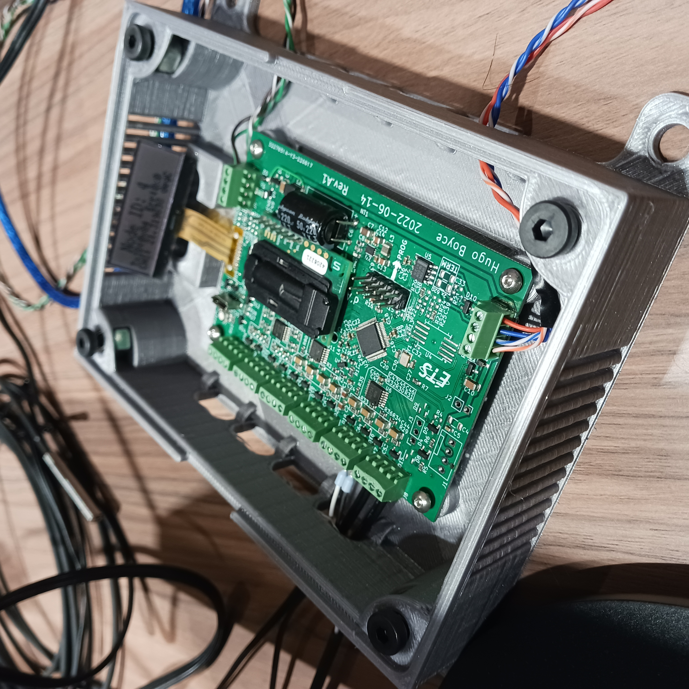
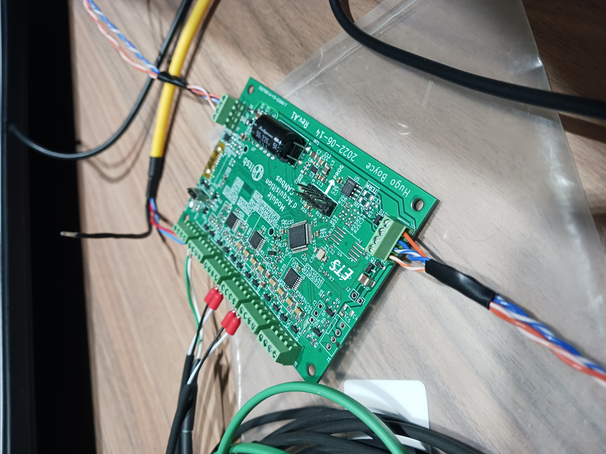
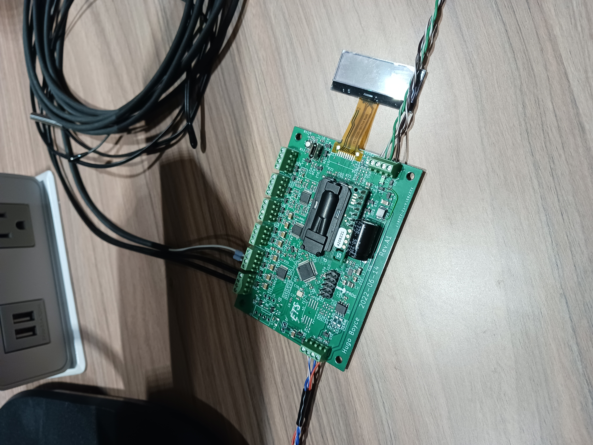
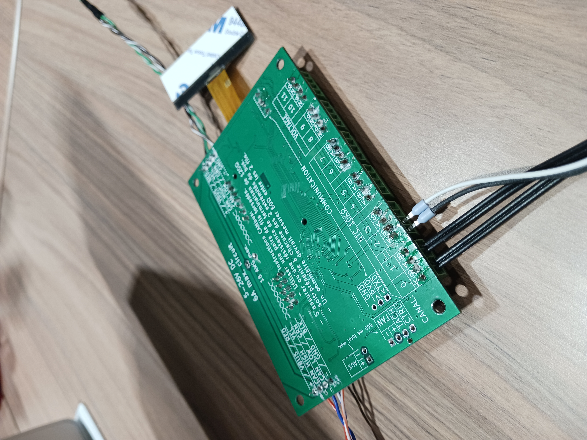

# CAN-Acquisition-Module_Hardware

It's a data acquisition module that can communicate to a PC (and to other modules) over CANbus. This allows for cheap & rugged hardware, as well as simplified wiring and long transmission distances.

At it's core is a Nuvoton M483 microcontroller (ARM Cortex-M4F). It has 8 thermistor inputs, 4 multipurpose analog inputs, and room to accomodate CO2 and/or humidity sensors over I2C or UART.

It can be configured & monitored over USB (it enumerates as a COM port adapter), and a basic screen is present to facilitate human identification and debugging.

The repository for the firmware can be found [here](https://github.com/hboyce4/CAN-Acquisition-Module_Firmware).
The repository the the PC server program can be found [here](https://github.com/hugoboyceets/CAN-Acquisition-Module_Server).

